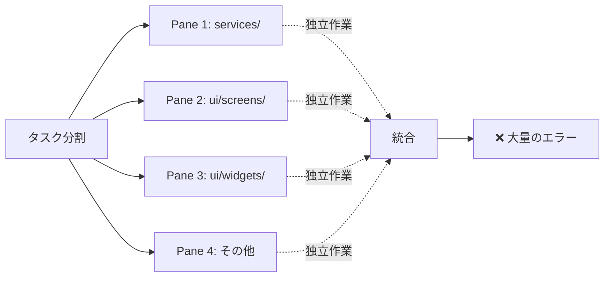
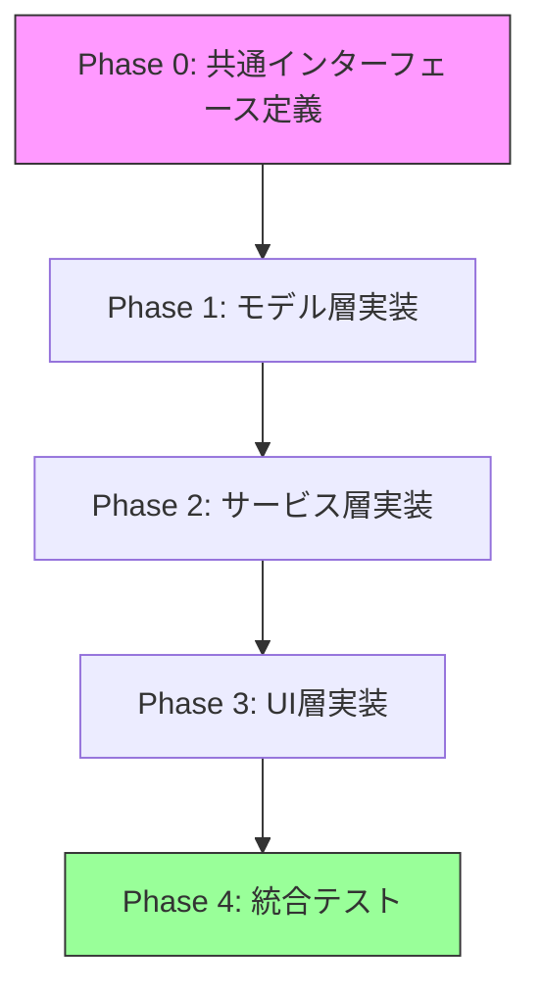
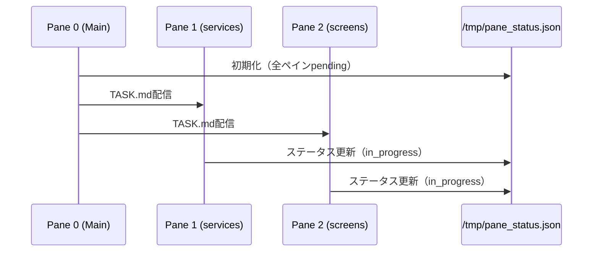
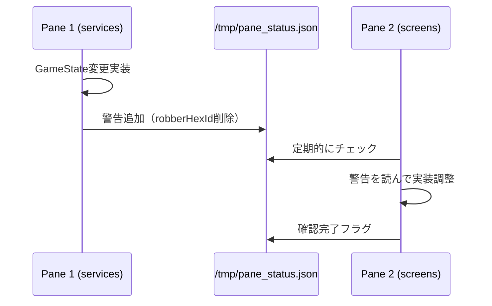
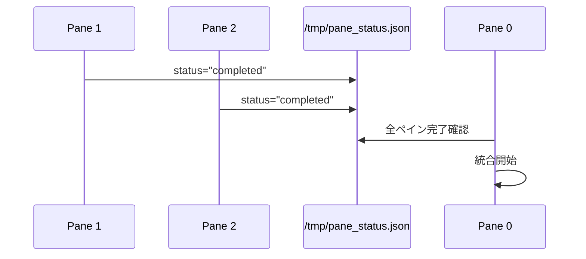

# 並列開発における教訓と反省点

## 日付
2025-11-09

## 概要
4つのペインを使った並列開発で、大量のビルドエラー（29個以上）が発生した原因と対策をまとめる。

---

## 今回のエラーの根本原因

### 1. **情報共有の不足**

#### 問題点
各ペインに与えたタスクが**独立しすぎていた**：

```markdown
# Pane 1のTASK.md
「services/内の全importを絶対パスに変更」

# Pane 2のTASK.md
「ui/screens/内の全importを絶対パスに変更」
```

各エージェントは**自分の担当ディレクトリのみ**を見て作業したため、以下の問題が発生：

- **相互依存の把握不足**: `GameState`のインターフェース変更（`robberHexId` → `robber`）を他のペインが知らない
- **重複作業**: 各ペインが独自に`GameState`を使用するコードを書いたが、統一されていない
- **検証不足**: 各ペインは自分のディレクトリ内でしかチェックしない

### 2. **アーキテクチャ変更の伝達漏れ**

#### 具体例
`GameState`の構造変更：

```dart
// 変更前（Pane 4が実装）
class GameState {
  String? robberHexId;  // 単純な文字列
}

// 変更後
class GameState {
  Robber? robber;  // オブジェクト化
}
```

**この変更を他のペインに伝えていなかった**ため、Pane 1（services）は古いAPIを使い続けた：

```dart
// game_service.dart（Pane 1が担当）
gameState.robberHexId = targetHexId;  // ❌ エラー！
```

### 3. **タスク分割の粒度が粗すぎた**

#### 問題のあった分割方法
```
Pane 1: services/
Pane 2: ui/screens/
Pane 3: ui/widgets/
Pane 4: その他
```

**ディレクトリ単位**での分割は一見効率的に見えるが、以下の問題がある：

- **横断的な変更に弱い**: モデルの変更は全ペインに影響
- **依存関係の複雑化**: services ↔ models ↔ ui の依存関係が見えない
- **統合時の衝突**: 各ペインが独立した実装をして、マージ時に矛盾

---

## 発生したエラーのカテゴリ別分析

### エラーカテゴリ1: モデル変更の伝播漏れ（11件）

```
Error: The getter 'robberHexId' isn't defined for the type 'GameState'.
Error: The setter 'robberHexId' isn't defined for the type 'GameState'.
```

**原因**: Pane 4が`GameState`を変更したが、Pane 1には伝わっていない

**影響ファイル**:
- `game_service.dart`（3箇所）
- `development_card_service.dart`（3箇所）
- `turn_service.dart`（1箇所）
- `game_controller.dart`（4箇所）

### エラーカテゴリ2: 未実装メソッド（10件以上）

```
Error: The method 'rollDice' isn't defined for the type 'GameService'.
Error: The method 'startNormalPlay' isn't defined for the type 'GameController'.
Error: The method 'canBuildSettlement' isn't defined for the type 'GameController'.
```

**原因**: UIペイン（Pane 2,3）が`GameController`のメソッドを想定して実装したが、Servicesペイン（Pane 1）には実装がなかった

### エラーカテゴリ3: コンストラクタの問題（5件）

```
Error: Cannot invoke a non-'const' constructor where a const expression is expected.
```

**原因**: `DevelopmentCard`のコンストラクタが`const`ではないのに、`const`で呼び出していた（Pane 1の実装ミス）

### エラーカテゴリ4: Widget APIの不一致（4件）

```
Error: Required named parameter 'hexTiles' must be provided.
Error: No named parameter with the name 'logs'.
```

**原因**: Pane 3がWidgetのAPIを変更したが、Pane 2（使用側）には伝わっていない

---

## 本来あるべき並列開発の進め方

### ❌ 今回の失敗例



### ✅ 改善案



---

## 具体的な改善策

### 1. **Phase-based 並列開発**

#### ❌ ディレクトリベース分割（今回）
```
Pane 1: services/全ファイル
Pane 2: ui/screens/全ファイル
Pane 3: ui/widgets/全ファイル
```

#### ✅ Phase-based 分割（改善案）
```
Phase 1（全ペイン共通）:
  - models/の定義完了を確認
  - GameState, Player, Robberなどの完全な実装

Phase 2（並列実行可能）:
  Pane 1: services/game_service.dart
  Pane 2: services/resource_service.dart
  Pane 3: services/turn_service.dart

Phase 3（Phase 2完了後）:
  Pane 1: ui/screens/setup_screen.dart
  Pane 2: ui/screens/normal_play_screen.dart
  Pane 3: ui/widgets/board/
```

### 2. **共通情報ファイルの作成**

各フェーズ開始前に`SHARED_CONTEXT.md`を作成：

```markdown
# 共通コンテキスト - Phase 2

## 完了した実装
- ✅ GameState構造確定
  - robber: Robber? (robberHexIdから変更)
  - players: List<Player>

## 全ペイン共通のルール
1. GameStateへのアクセスは必ず`gameState.robber?.currentHexId`
2. 盗賊移動は`gameState.robber?.moveTo(hexId)`
3. import は全て package:test_web_app/... 形式

## 各ペインの担当API
- Pane 1: GameService.rollDice() を実装
- Pane 2: ResourceService.distributeResources() を実装
- Pane 3: TurnService.nextTurn() を実装

## 検証方法
各ペインは実装後、以下を確認:
```bash
grep -r "robberHexId" lib/
# 結果が0件であること
```
```

### 3. **インターフェース固定ルール**

```markdown
## ルール: 公開APIの変更は禁止

Phase 2以降、以下のファイルの**公開インターフェース**変更は禁止：

- models/game_state.dart
- models/player.dart
- models/robber.dart
- services/game_controller.dart（UIが使用するメソッド）

変更が必要な場合：
1. 全ペインに通知
2. SHARED_CONTEXT.mdを更新
3. 全ペインが確認後に変更
```

### 4. **検証ステップの明確化**

各ペインのTASK.mdに以下を含める：

```markdown
## 実装後の検証（必須）

### 1. 自ディレクトリ内の検証
```bash
cd /root/worktrees/services
grep -r "robberHexId" lib/services/
# 結果: 0件であること
```

### 2. 他ディレクトリへの影響確認
```bash
# メインリポジトリで確認
cd /root/test_web_app
grep -r "import.*services/game_service" lib/ui/
# 全てのimportが正しいか確認
```

### 3. モデル使用の一貫性確認
```bash
grep -r "gameState\.robber" lib/
# 全て .robber?.currentHexId 形式であること
```

### 4. コミット前の必須チェック
```bash
# 相対importが残っていないか
grep -r "import '\.\." lib/

# 古いパスが残っていないか
grep -r "controllers/" lib/
```
```

### 5. **段階的マージ戦略**

```markdown
## マージ順序（重要）

❌ 今回の失敗:
全ペインを同時にマージ → 統合時に大量エラー

✅ 改善案:
1. Pane 1をマージ → ビルド確認
2. Pane 2をマージ → ビルド確認
3. Pane 3をマージ → ビルド確認
4. Pane 4をマージ → ビルド確認

各マージ後、エラーが出たらその場で修正してから次へ進む
```

---

## 並列開発チェックリスト

今後の並列開発時に使用するチェックリスト：

### Phase 0: 計画段階
- [ ] 共通インターフェース（models/）が確定しているか
- [ ] 各ペインの依存関係を明確化したか
- [ ] SHARED_CONTEXT.mdを作成したか
- [ ] 公開API変更禁止ルールを全ペインに伝えたか

### Phase 1-N: 実装段階
- [ ] 各ペインのTASK.mdに検証ステップを含めたか
- [ ] 共通コンテキストファイルへの参照を含めたか
- [ ] インターフェース変更時の通知方法を決めたか

### Phase X: 統合段階
- [ ] 1ペインずつマージしているか
- [ ] 各マージ後にビルド確認したか
- [ ] エラーを次のマージ前に修正したか

---

## 具体的なTASK.mdテンプレート（改善版）

```markdown
# Task: services/game_service.dart の実装

## 🔗 共通コンテキスト
**必読**: `/root/test_web_app/docs/SHARED_CONTEXT.md`

## 📋 実装内容
以下のメソッドを実装してください：

### 1. rollDice()
- 戻り値: `DiceRoll`
- GameStateに依存: `gameState.lastDiceRoll` を更新

### 2. moveRobber()
- ⚠️ 重要: `gameState.robber?.moveTo(hexId)` を使用
- ❌ 禁止: `gameState.robberHexId = hexId` （このプロパティは削除済み）

## ✅ 検証ステップ（実装後必須）

### Step 1: 自ファイル内チェック
```bash
grep "robberHexId" lib/services/game_service.dart
# 期待結果: 0件
```

### Step 2: 共通ルール遵守確認
```bash
grep "robber\." lib/services/game_service.dart
# 全て .robber?.currentHexId または .robber?.moveTo() であること
```

### Step 3: Import確認
```bash
head -20 lib/services/game_service.dart | grep "import"
# 全て package:test_web_app/... 形式であること
```

## 🚫 禁止事項
1. GameStateの構造変更
2. 相対importの使用
3. robberHexIdプロパティの使用

## ✅ 完了基準
- [ ] rollDice()実装完了
- [ ] moveRobber()実装完了
- [ ] 全検証ステップクリア
- [ ] import全て絶対パス

## 📝 コミットメッセージ
```bash
git commit -m "feat(services): game_service.dartにrollDice/moveRobber実装"
```
```

---

## まとめ: 今回の教訓

### 失敗の本質
「**並列化による効率化**を優先しすぎて、**情報共有とインターフェース管理**を怠った」

### Key Takeaways

1. **並列開発 ≠ 独立開発**
   - 各ペインは独立して動くが、**共通のコンテキスト**を共有する必要がある

2. **Phase-based > Directory-based**
   - ディレクトリ分割は依存関係を無視しやすい
   - フェーズ分割は依存関係を明示化する

3. **検証は各ペインの責任**
   - 統合時のエラーは避けられない
   - **各ペインが自分の実装を検証する文化**が必要

4. **共通情報ファイルは必須**
   - SHARED_CONTEXT.mdのような**全ペイン共通のドキュメント**
   - 公開APIの変更履歴
   - 禁止事項リスト

5. **段階的マージが安全**
   - 全ペイン同時マージは高リスク
   - 1ペインずつマージ→ビルド→修正のサイクル

---

---

## 改善案: tmuxペイン間の情報共有

### 共有ステータスファイルの活用

各ペインが共通ファイルを読み書きすることで、リアルタイムに情報共有が可能：

#### `/tmp/pane_status.json`の例
```json
{
  "pane1_services": {
    "status": "completed",
    "timestamp": "2025-11-09T10:30:00",
    "changes": [
      "GameState.robber?.currentHexIdに変更",
      "rollDice()メソッド実装完了"
    ],
    "warnings": [
      "robberHexIdプロパティは削除されました"
    ]
  },
  "pane2_screens": {
    "status": "in_progress",
    "timestamp": "2025-11-09T10:25:00",
    "reading_shared_context": true
  },
  "pane3_widgets": {
    "status": "waiting",
    "timestamp": "2025-11-09T10:20:00",
    "waiting_for": ["pane1_services"]
  },
  "pane4_integration": {
    "status": "pending",
    "timestamp": "2025-11-09T10:15:00"
  }
}
```

#### 各ペインのTASK.mdに追加する指示

```markdown
## 📡 ペイン間通信

### 作業開始時
1. ステータスファイルを確認:
```bash
cat /tmp/pane_status.json | jq '.pane1_services'
```

2. 他ペインの変更を確認:
```bash
cat /tmp/pane_status.json | jq '.[] | select(.changes != null) | .changes'
```

### 作業完了時
1. 自分のステータスを更新:
```bash
cat > /tmp/pane_status_update.sh << 'EOF'
jq '.pane1_services = {
  "status": "completed",
  "timestamp": "'$(date -Iseconds)'",
  "changes": [
    "GameController.rollDice()実装完了",
    "robberHexId → robber.currentHexIdに変更"
  ],
  "warnings": [
    "GameService.rollDice()は引数不要に変更"
  ]
}' /tmp/pane_status.json > /tmp/pane_status_new.json
mv /tmp/pane_status_new.json /tmp/pane_status.json
EOF
bash /tmp/pane_status_update.sh
```

2. メインペイン（Pane 0）に報告:
```bash
echo "[PANE-1] 作業完了。変更内容は /tmp/pane_status.json を確認してください。" > /tmp/pane1_report.txt
```
```

### 統合管理者（Pane 0）の役割

```markdown
## Pane 0（メイン）の責務

### 1. 初期化
```bash
# 共有ステータスファイル作成
cat > /tmp/pane_status.json << 'EOF'
{
  "pane1_services": {"status": "pending", "timestamp": ""},
  "pane2_screens": {"status": "pending", "timestamp": ""},
  "pane3_widgets": {"status": "pending", "timestamp": ""},
  "pane4_integration": {"status": "pending", "timestamp": ""}
}
EOF
```

### 2. 進捗監視
```bash
# 5秒ごとにステータス確認
watch -n 5 'cat /tmp/pane_status.json | jq'
```

### 3. 完了確認
```bash
# 全ペイン完了確認
cat /tmp/pane_status.json | jq 'all(.status == "completed")'
# true が返れば全完了
```

### 4. 警告の集約
```bash
# 全ペインの警告を集約
cat /tmp/pane_status.json | jq '[.[] | select(.warnings != null) | {pane: .pane, warnings: .warnings}]'
```
```

### ペイン間通知の例

#### Pane 1（services）が重要な変更を通知

```markdown
## 作業完了後の通知

### 重要な変更があった場合
1. ステータスファイルに警告を追加
2. 影響を受けるペインに通知ファイルを作成

```bash
# Pane 2（screens）への通知
cat > /tmp/notify_pane2.txt << 'EOF'
⚠️ IMPORTANT CHANGE from Pane 1 (services)

変更内容:
- GameState.robberHexId プロパティを削除
- 新しいAPI: gameState.robber?.currentHexId

必要な対応:
1. setup_screen.dartで robberHexId を使用している場合は修正
2. 新しいAPI: gameState.robber?.moveTo(hexId)

詳細は /tmp/pane_status.json の pane1_services.changes を確認
EOF

# Pane 2に読んでもらう
echo "cat /tmp/notify_pane2.txt" >> /root/worktrees/ui-screens/TASK.md
```
```

---

## ベストプラクティス: 情報共有フロー

### Phase開始時



### 作業中の情報共有



### 完了報告



---

## 次回への適用（更新版）

次回の並列開発では：

1. ✅ Phase 0で`SHARED_CONTEXT.md`作成
2. ✅ `/tmp/pane_status.json`による進捗共有
3. ✅ 各TASK.mdに検証ステップ明記
4. ✅ 重要な変更時は通知ファイル作成
5. ✅ 公開API変更の禁止ルール設定
6. ✅ Pane 0が全ペイン監視
7. ✅ 1ペインずつマージ戦略

これにより、**並列開発の効率**を保ちつつ、**リアルタイム情報共有**と**品質確保**を実現する。
